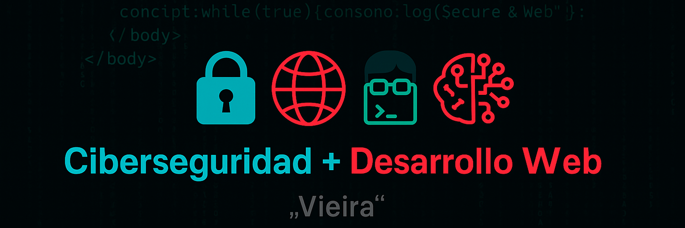

<h2 align="center">  ¡Hola! Soy Vieira </h2>

  

  🎓 Profesional de desarrollo web y sistemas informáticos 
  🔐 Apasionado por la <strong>programación</strong>, la <strong>ciberseguridad</strong> y el desarrollo de herramientas útiles como <strong>TDAtracker</strong> 
  📺 Creador de contenido en <a href="https://youtube.com/@VieiraDevSec" target="_blank" rel="noopener noreferrer">YouTube</a> sobre programación, Linux y ciberseguridad 
  📫 Contacto: <a href="mailto:vieiraj4@gmail.com">vieiraj4@gmail.com</a>

---

## 🚀 Proyectos destacados

- 🧠 [TDAtracker](https://github.com/VieiraMohamed/TDAtracker) — App web integral para personas con TDA/TDAH  
- 🎉 [Exponga](https://github.com/VieiraMohamed/Exponga) — App web de eventos
 
---

🧠 Certificaciones en Ciberseguridad
📜 Cisco Ethical Hacker (Nivel intermedio)
Curso completo en pruebas de penetración, análisis ofensivo y uso de herramientas reales, ofrecido por Cisco Networking Academy.

🔗 Ver insignia en Credly
📅 Emitido: 30 de diciembre de 2024

Módulos completados
🔐 Introducción al hacking ético y pruebas de penetración

📑 Planificación y alcance de una evaluación de pentest

🕵️ Recolección de información y escaneo de vulnerabilidades

🎭 Ingeniería social y ataques de manipulación humana

🌐 Explotación de redes cableadas e inalámbricas

🧱 Explotación de vulnerabilidades en aplicaciones

☁️ Seguridad en entornos cloud, dispositivos móviles e IoT

🧠 Técnicas de post-explotación y persistencia

📊 Elaboración de informes y comunicación de hallazgos

💻 Análisis de herramientas, scripts y revisión de código

Tecnologías y herramientas utilizadas

        

## 🧠 Certificación en Ciberseguridad por Google

El programa <a href="https://www.coursera.org/professional-certificates/google-cybersecurity" target="_blank" rel="noopener noreferrer"><strong>Google Cybersecurity Professional Certificate</strong></a> en Coursera, diseñado para preparar a futuros analistas de ciberseguridad mediante simulaciones reales y uso de herramientas industriales.

### 🔍 Contenidos clave aprendidos

- Fundamentos de ciberseguridad: CIA Triad, NIST Framework, CIS Controls  
- Evaluación de riesgos, activos, amenazas y vulnerabilidades  
- Seguridad en redes, IDS/IPS,HIDP/NIDS, firewalls y protocolos  
- Análisis de tráfico con Wireshark y tcpdump  
- Automatización con <strong>Python</strong> y análisis de datos con <strong>SQL</strong>  
- Gestión de eventos e incidentes con <strong>Splunk</strong> y <strong>Google Chronicle</strong> (SIEM)  
- Investigación forense, respuesta a incidentes y buenas prácticas  

### 🛠️ Herramientas y tecnologías

  
  
  
  
  
  
  
  

---

## 🛠️ Tecnologías y herramientas

### Desarrollo

  
  
  
  
  
  

### Seguridad y análisis

  🔐 Encriptación, análisis de logs, SIEM, detección de intrusiones, automatización de respuestas

---

## 📚 Formación y certificaciones

- 🎓 Título profesional en Desarrollo Web y Sistemas Informáticos
- 🧩 Curso intermedio de **Cisco Networking Academy**  
- 🛡️ **Google Cybersecurity Professional Certificate** *(En proceso)*  
- 🧠 Conocimientos en **análisis de riesgos**, **seguridad en redes**, **bash scripting**, y **automatización con Python**

---

## 📺 También en YouTube

  🎥 Explico mis proyectos y desarrollo en mi canal:

  

---

## 📈 GitHub Stats

  

---

## 💡 Intereses

- 🔐 Ciberseguridad y análisis forense  
- 🌐 Desarrollo web full stack  
- 🧠 Proyectos educativos y accesibles con impacto social  
- 🧰 Automatización de tareas con scripts

---

<em>Gracias por visitar mi perfil. ¡Estoy siempre abierto a colaborar o aprender algo nuevo!</em>

